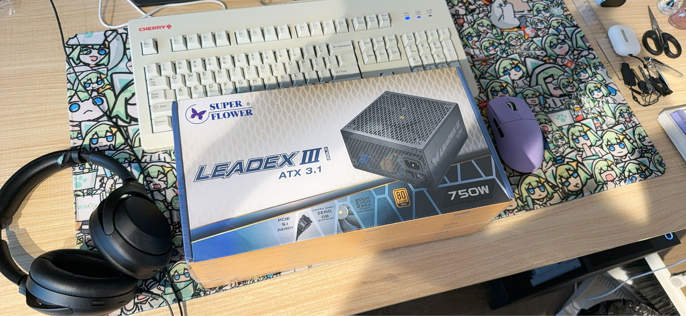
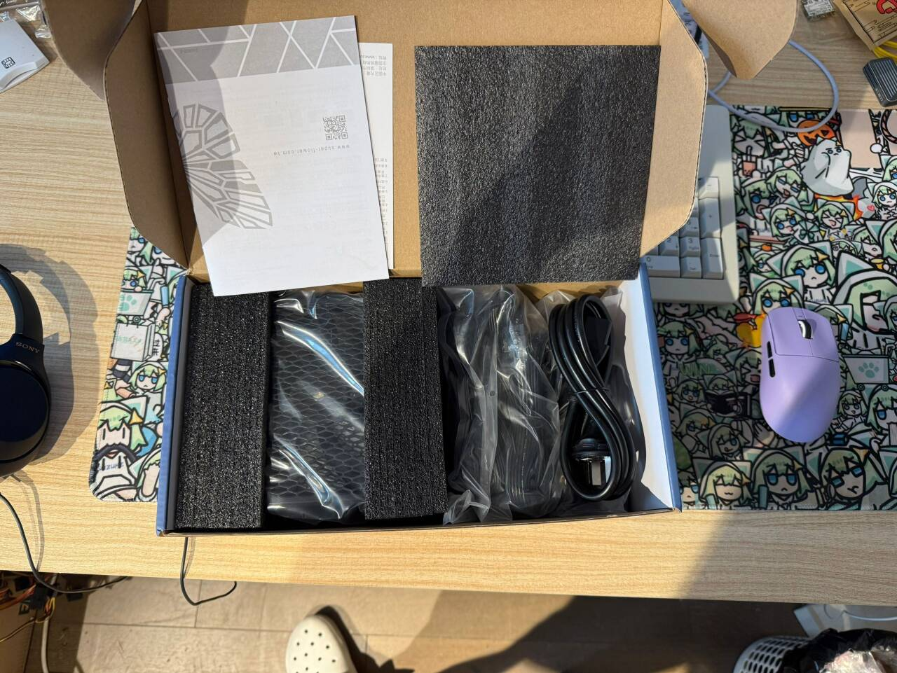
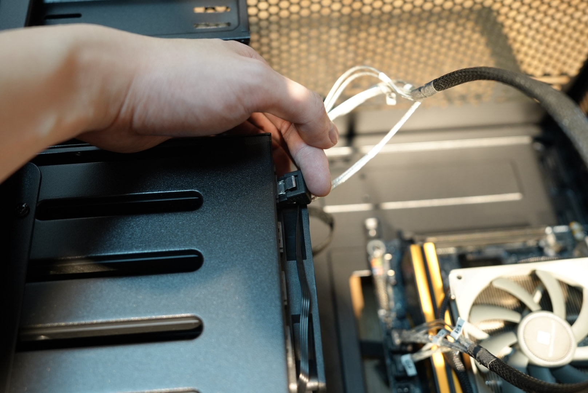
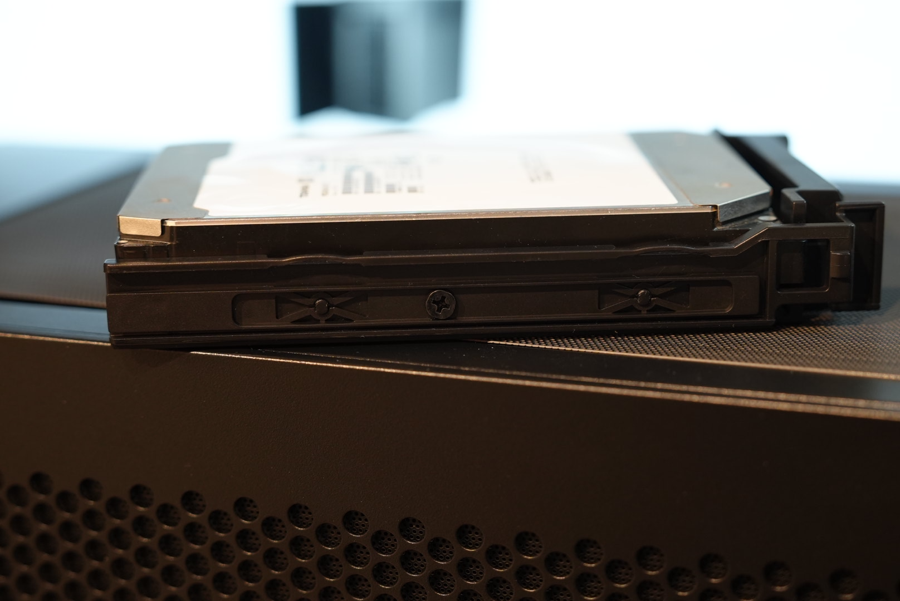
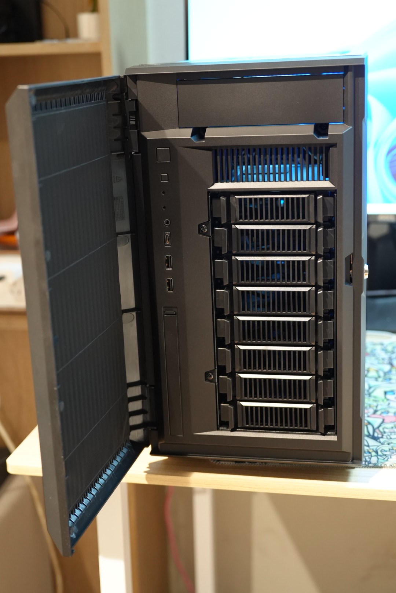
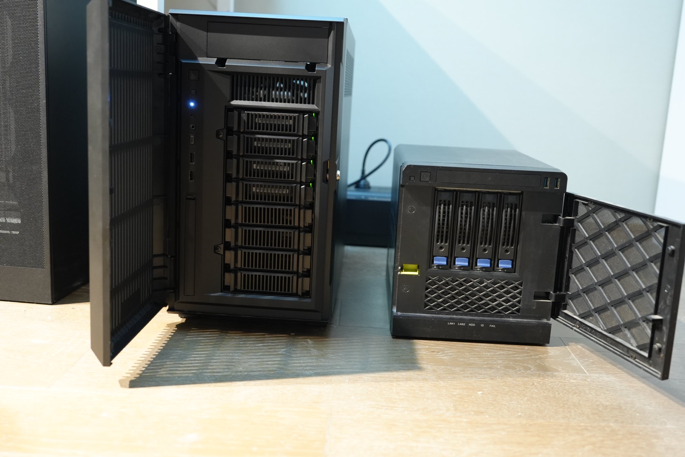
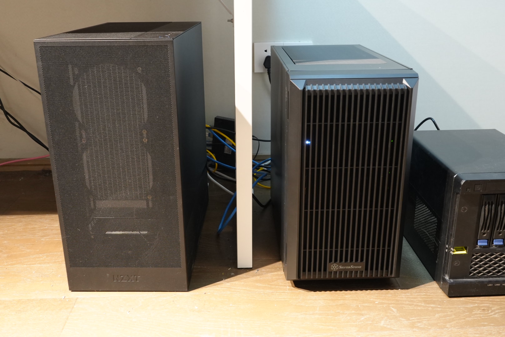
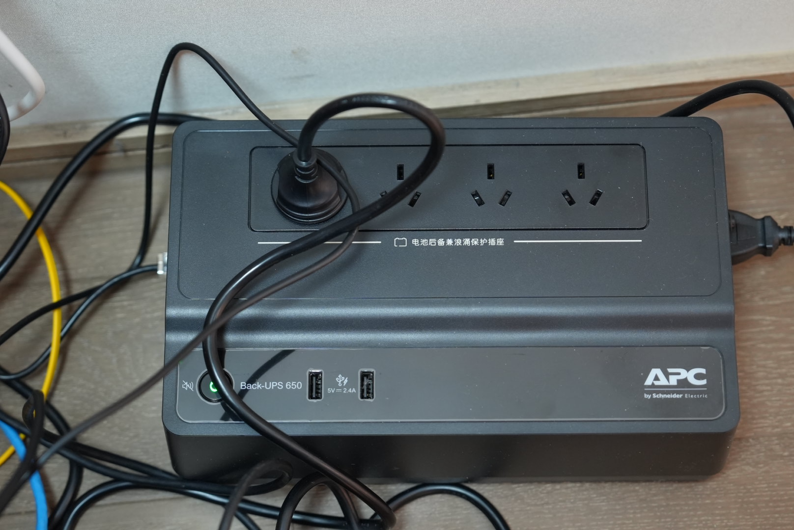
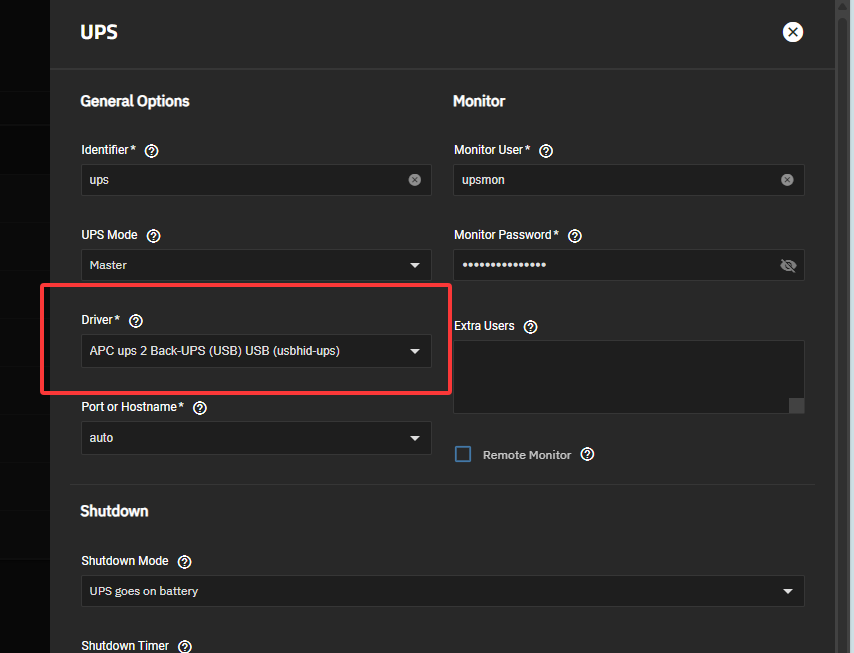

## 为什么要更换机箱

INWIN 的 MS04 作为 NAS 机箱在我这服役多年，承载了 凄惨红H61 + i5-3470 和 华擎H97M-ITX/ac + E3-1265Lv3 两代硬件，当我这几天想给他升级 B760I + i3-12100 时，机箱的原装电源终于是吃不太消，来自 1U 电源风扇轴承的声音到达了一个让人难以忍受的程度。

为了拯救这个老机器，我还尝试购买了一下海韵的 350M1U 电源更换上去，当时看中的是海韵的 50% 以下电源负载时风扇停转功能。但是这个电源，在 MS04 这个箱子里的散热有点问题，导致虽然时低负载情况下，依旧会在开启一段时间后积热，然后风扇开始转动，海韵给这个电源配备了恐怖的万转风扇，这个风扇在这种情况下并未全速运行，但是依旧有令人讨厌的声音。

还有一点就是，原机上是 4*14T 的 WD HC530 硬盘，其实也有点不够用

终于，在清明节晚上大半夜，我决定是时候光荣退役这台 MS04，换个新的 8 盘位 NAS 机箱。

## 机箱选型

考虑过以下几个机箱选型

### 迎广 MS08

那么大一个箱子，明明不缺空间，用的却是 1U 电源，排除

### 银欣 DS380

虽然是个8盘位箱子，但是硬件兼容性还是小机器那套，排除，不过体积确实小

### 宝藏盒 Pro

小作坊的定制产品，我还挺喜欢，用的曙光的金属盘架，不过非常贵，1399，排除

### 银欣 CS380

发布有些年头了，兼容 ATX 主板，塑料盘架，黄鱼400块，京东700块

### 银欣 CS382

最终选用了这款，兼容 mATX 主板，塑料盘架，京东899，单纯觉得看着比 CS380 顺眼就买了。

## 电源

电源没啥好说的，海韵和振华的十年质保系列看哪个便宜买哪个就好了。不过离谱的是，刚好赶上振华打折，750W比650W便宜，那就买个750W好了（不过说到底，这套配置哪怕硬盘插满可能连 200W 都到不了吧）

顺带说一下振华的新版电源，之前买HG850的时候，他的模组线有送个布袋，但是现在这个新版750W没了，不过附带的新版模组线，比以前的线软了很多很多，好插多了。

## 装机

很普通的装机，看我博客的人应该不需要看装机过程，很好装的机箱

值得说的一点就是，硬盘笼上的 SATA/SAS 接口是不兼容右向弯头线材的

以及盘架是类似群晖那种，我并不喜欢，建议直接兼容戴尔的服务器盘架算了，不过相比群晖，给了一个螺丝孔加固

机箱前面板，我到手才知道，这个箱子不仅有一个标准的光驱位，还有个超薄光驱位

## UPS

由于我现在住的公寓非常逆天，电费没了之后，不会给任何提示就断电，所以一台 UPS 还是很有必要的，地铁一小时按群友价去收了一台全新的 APC BK650M2-CH

在 TrueNAS 中选好驱动即可使用

## 装完后剩余槽位与后续改进
1. 3.5盘位 1 个, 该盘位为内置盘位，没有背板，用SATA线直接连接
2. 薄光驱位 1 个, 考虑后续真的放个光驱进去
3. 厚光驱位 1 个, 考虑后面买个热插拔 2.5 硬盘拓展笼子或者 E1.S 笼子
4. 2.5英寸盘位 2 个, 来点 U2 大船
5. 主板，迟早要把这个 ITX 板子卖了换个大板子

## 附录

### 配件价格表

| 类型 | 名称 | 数量 | 来源 | 总价(CNY) |
| ---- | ---- | ---- | ---- | ---- |
| 机箱 | 银欣 CS382 | 1 | 京东 | 899 |
| 电源 | 振华 LEADEX III GOLD 750W | 1 | 京东 | 659 |
| 机械硬盘 | WD HC530 | 4 | 上台NAS继承 | 0 |
| 机械硬盘 | 东芝 MG08 | 4 | 淘宝 | 3356 |
| M2 SSD (Cache) | PM981a 1T | 1 | 上台NAS继承 | 0 |
| M2 SSD (OS) | SN750 500G | 1 | 上台NAS继承 | 0 |
| SAS卡 | 浪潮拆机卡 | 1 | 咸鱼 | 50 |
| SAS线 | 安费诺一分四服务器拆机 | 2 | 咸鱼| 120 | 
| 主板 | B760I | 1 | 上台NAS继承 | 0 | 
| CPU | i3 12100 | 1 | 上台NAS继承 | 0 |
| 内存 | 阿斯加特 16G 7000Mhz DDR5 | 2 | 上台NAS继承 | 0 |
| 散热器 | AXP90x53 | 1 | 上台NAS继承 | 0 |
| 网卡 | 华为 SP310 | 1 | 上台NAS继承 | 0|
| UPS | APC BK650M2-CH | 1 | 杭州本地群友 | 299 |
| 总价 | | | | 5383 |
