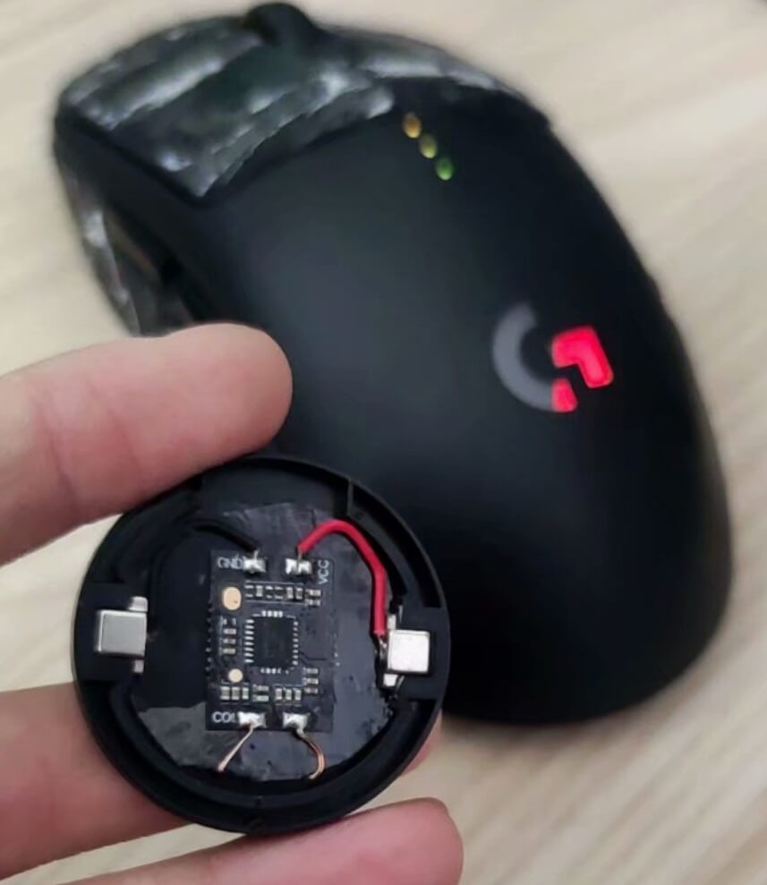

+++
title = "为GPW DIY一个Qi充电模块"
date = "2020-12-25T12:36:51+08:00"
tags = ["折腾"]
image = "gpwqi2.jpg"
description = ""
+++

整了一个罗技自家的PowerPlay,然而用下来之后感觉这玩意鼠标垫面积太小了,打星际的时候拉不开(DPI 1650 游戏内速度49%)

所以拿底盖改装了一个Qi充电套件qwq

