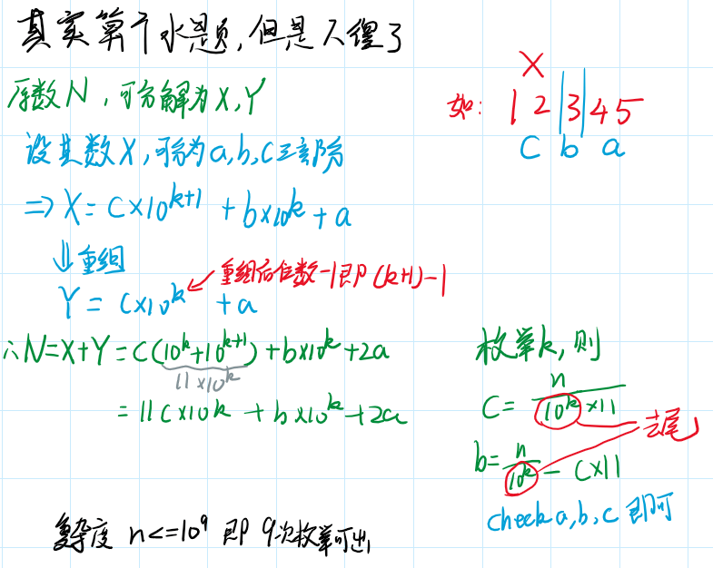

其实是一道大水题,但是自己写的时候一开始居然没想到去枚举k就可以了,确实不擅长做数学题



```cpp
#include<bits/stdc++.h>
//#include<bits/extc++.h>
#define int long long
//#define int __int128
#define ull unsigned long long
#define mmst0(x) memset(x,0,sizeof(x))

using namespace std;
//using namespace __gnu_pbds;

const int INF=0x3f3f3f3f;

int read(){char c;int num,f=1;while(c=(char)getchar(),!isdigit(c))if(c=='-')f=-1;num=(int)(c-'0');while(c=(char)getchar(),isdigit(c))num=num*10+(int)(c-'0');return num*f;}
void prt(int x){if(x<0){putchar('-');x=-x;}if(x>9)prt(x/10);putchar((char)(x%10+'0'));}

int n,a,b,c;
int t[10000];

void work()
{
    while(n=read())
    {
        int cnt=0;
        for(int k=1;k<=n;k*=10)//枚举k,此处k为10^k
        {
            c=(n/k)/11;//去掉了后面k未之后就剩下前几位,即为c;
            b=n/k-c*11;//前k位减去11c就是b
            if((b!=0 || c!=0) && b<10)//b<10是存在进位
            {
                a=(n-b*k-11*c*k)/2;
                if(2*a+b*k+11*c*k==n) 
                    t[++cnt]=a+b*k+c*k*10;
            }
            b--;
            if((b!=0 || c!=0) && b>=0)
            {
                a=(n-b*k-11*c*k)/2;
                if(2*a+b*k+11*c*k==n) 
                    t[++cnt]=a+b*k+c*k*10;
            }
        }

        if(!cnt)
        {
            printf("No solution.\n");
        }
        else
        {
            sort(t+1,t+1+cnt,[](int a,int b){
                return a<b;
            });
            printf("%d",t[1]);
            for(int i=2;i<=cnt;i++) if(t[i]!=t[i-1]) printf(" %d",t[i]);
            printf("\n");
        }
    }
    return;
}

/*
N=2a+b*10^k+11c*10^k
*/
signed main()
{
    //ios::sync_with_stdio(false);cin.tie(NULL);
    int T=1;//read();
    for(int Case=1;Case<=T;Case++)
    {
        //printf("Case #%d: ",Case);
        work();
    }
    return 0;
}
```

