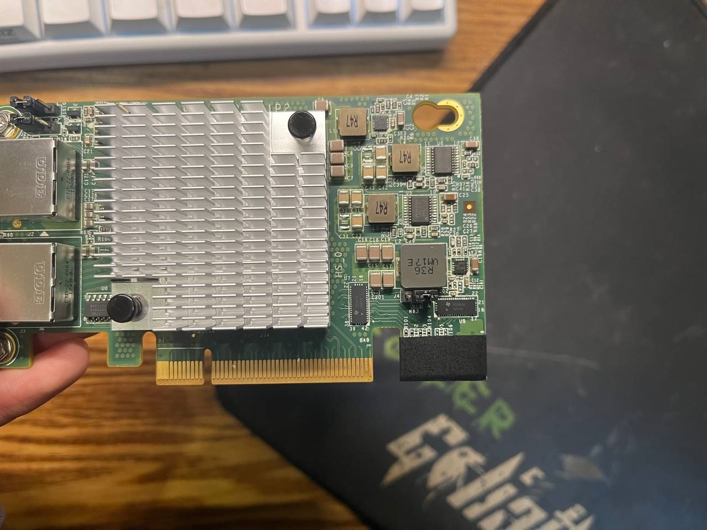
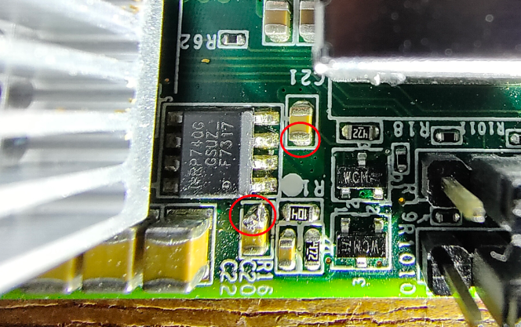
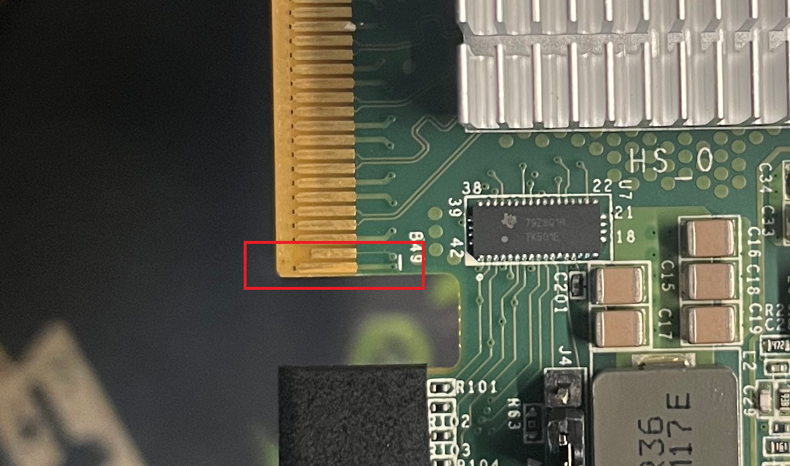
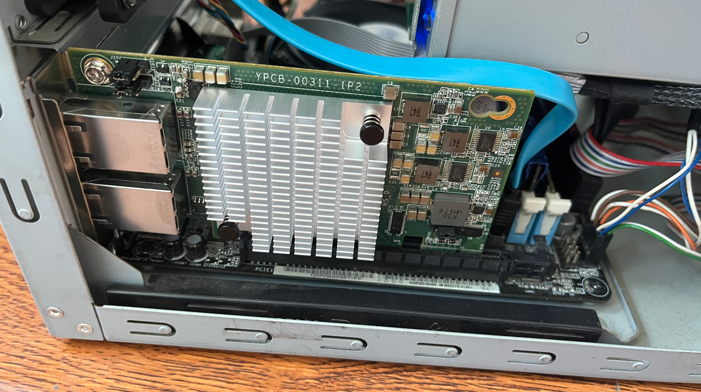
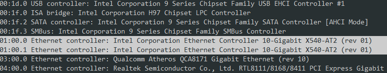
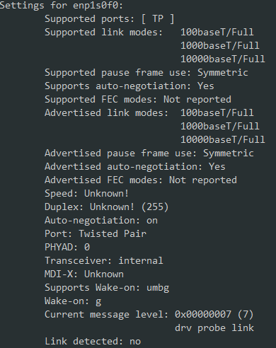

## 硬改

显然，这张卡那么便宜是有原因的……这玩意的硬件兼容性堪忧，我在最后附上吧友整理的兼容性列表

而我所用的主板（华擎H97M-ITX/ac)，恰巧不在兼容列表里面，所以没法用透明胶带简单的屏蔽后直接使用，因此需要按照贴吧[指北贴](https://tieba.baidu.com/p/7972296857)硬改

1. 先用电工胶带屏蔽后面的PCIE x1金手指



2. 插上不开机。主板供电问题，3.3v待机的功率不够，一般表现是开机风扇转一下就停或者没反应。需要飞线把网卡的3.3V和3.3VSB两路电压合并成一路。



这里借用一下吧友的图，我自己的卡上机了

或者这一步也可以直接短接B8和B10引脚，看个人喜好。

最后用胶带屏蔽B10引脚（3.3V待机引脚）

另外这会导致WOL失效

3. 进系统不识别，解决方法是一坨锡直接短接PCIE X8的最后两PIN



接着插上开机进系统识别可用一气呵成



进系统`lspci`看一下



再看一眼`ethtool`



另外说一下吧友的结论，不仅是Linux/Windows可用，再群晖和macOS下也正常工作

所以，60包邮要什么自行车，如果不想自己硬改的话，某宝有65不包邮包硬改的商家，或者选一块正好在兼容性列表里的主板（其实X79、X99、服务器主板或者供电好一点的主板一般都行）


## 附录-NAS吧吧友自测兼容性列表

```plain
华擎x79 极限玩家3 使用离cpu最远的那根pcie，

bios里设置这根pcie为3.0 x8模式，其他pcie插槽先设置成pcie 1.0，

等插上网卡再进bios把其他插槽设置成pcie 3.0 可以完美使用

华硕b150/b250 plus 两根全长pcie插槽都可以正常使用，无需设置

技嘉b250m d3h 两根全长pcie插槽都可以正常使用，无需设置

技嘉b660m d3h /b660m 雪雕 两根全长pcie插槽可以正常使用，无需设置

华擎 b150m pros4 两根全长pcie插槽都可以正常使用，无需设置 ——最爱授权管理

华硕TUF B550M-PLUS WIFI II插在南桥出来的x4槽可以识别使用​ 离回

x99和z77都是得插全针 柠檬汁挤入眼

商务主机 vostro 3681 咖啡萌萌哒

X99DELUXE 老弟五十号

华硕Z170-DELUXE第一和第三显卡插槽可以，华硕B150M/B365M/B460M/B560可以，华硕TUF B460M PRO第一第二显卡插槽可以，华硕Z590-A吹雪主板第一显卡插槽可以，第二第三显卡插槽不行，我看也是走的CPU通道，PCI-E X4插槽可以走的南桥通道，华擎H470M-ITX显卡插槽不行  云中漫步2006

豆希B360主板可以识别，Windows10与​黑群​晖3622+可以装上驱动！威联通873A可以识别使用！贫嘴贱齿愤青

华硕b250m plus 技嘉b365m小雕 派大星official

微星b450m迫击炮必须使用第一个槽，下面第二槽经常用着用着报错误代码​ cc星辰star
```