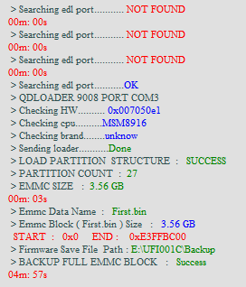
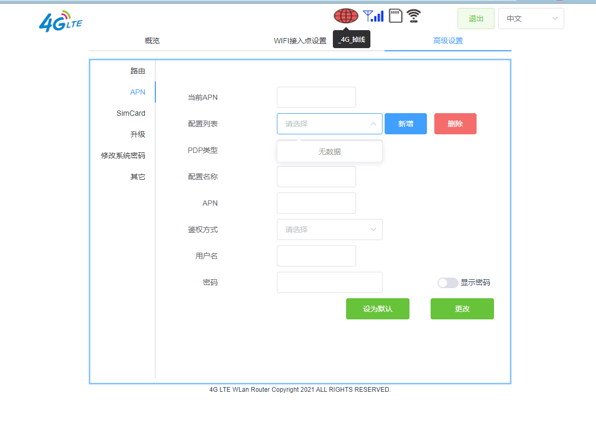

上次折腾随身WIFI还是高中的时候的[阿尔卡特Y855](https://www.mobosdata.com/phone/alcatel-one-touch-link-y855/)不得不说那玩意的性能可比这破棒子强多了，2GB RAM，4GB eMMC，支持SD卡，高通MDM9225基带，3000mAh电池，最关键的是，SSH是直接开放的(root\@192.168.1.1，密码oelinux123)

这次这个主要是看见灵车手痒了，折腾完了才想起自己的电脑好像是有WWAN模块的……

## 备份

这里其实没啥值得说的，但是有一点就是我的电脑原来就装了小米的9008驱动，但是这个驱动莫名其妙搜不到设备


在这里选中2.1.22版本驱动即可正常的全量备份



耗时约5分钟

## 刷全网通与切卡

原来我是准备直接刷OpenWRT或者Debian的，但是我插了自己卡（联通）工作不正常，所以想着直接把全网通基带也刷了算了

刷基带（备份基带）一种是有root权限，直接用酷安各类教程里写的“星海SVIP”（其实我觉得这软件难用的EB）

```sh
adb reboot bootloader
# 然后你需要一个 Magisk 打过 Patch 的 boot.img
fastboot flash boot boot_patched.img
fastboot reboot
```
接着“星海SVIP”里点“高通强开1”，接着备份和刷入

还有一种就是直接用QPST的备份.xqcn功能

刷完全网通之后的连接还是不正常，此时切卡后的界面是这样的



## 待续

写到这里突然发现我有个大作业快DDL了……