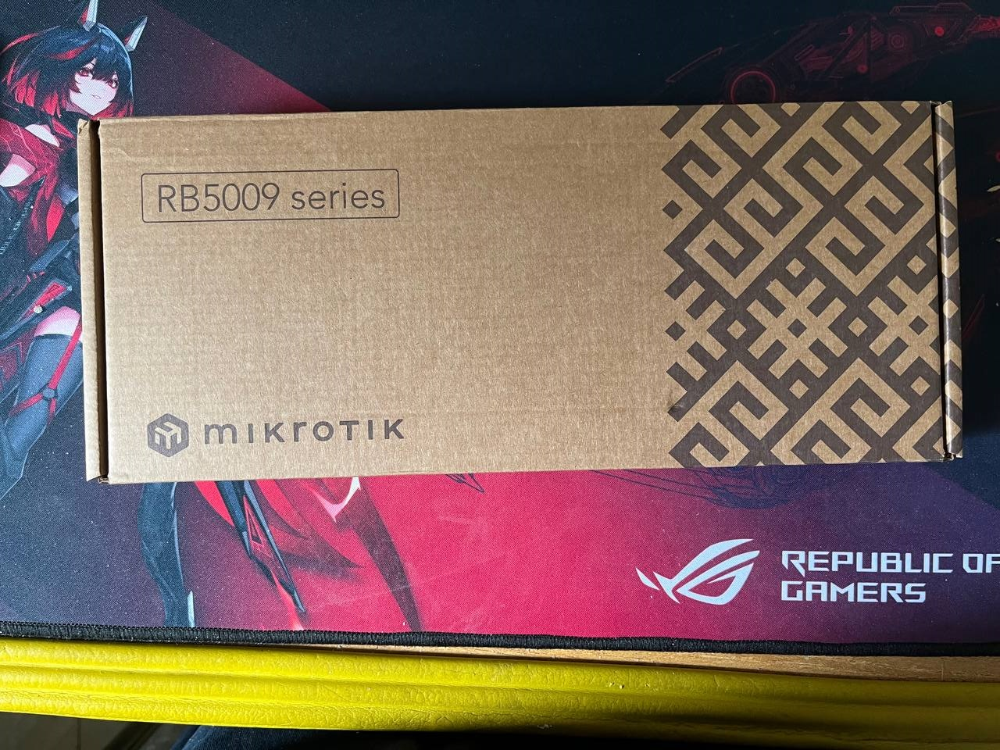
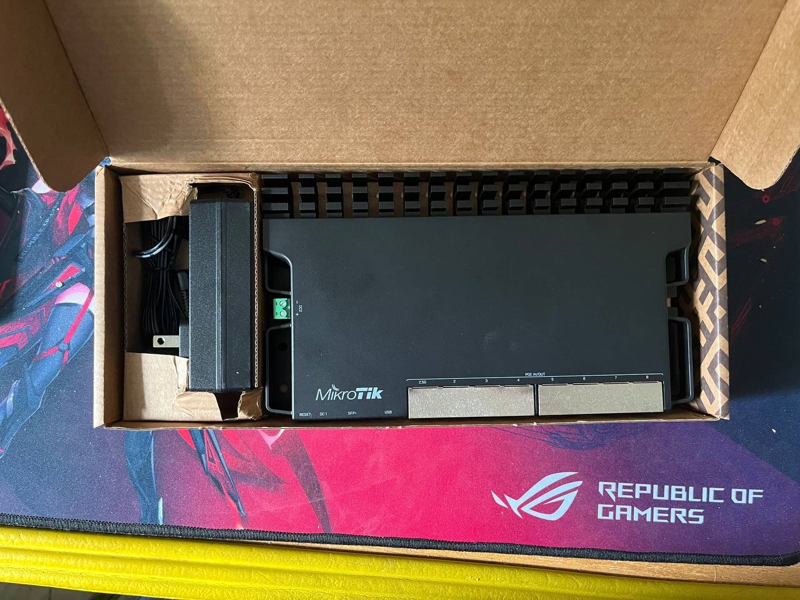
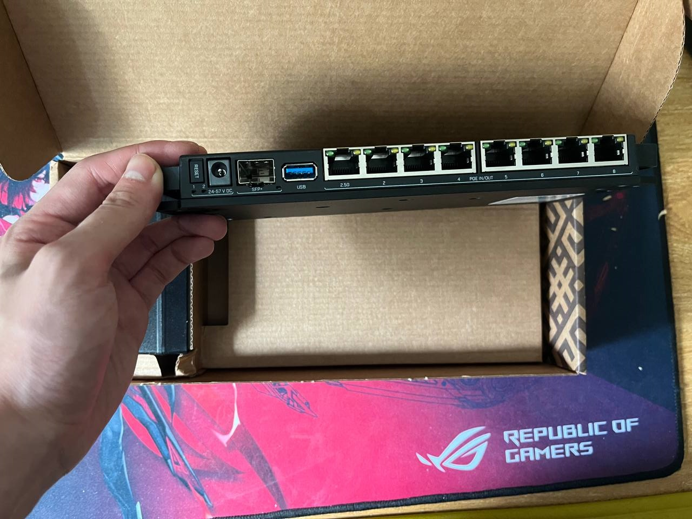
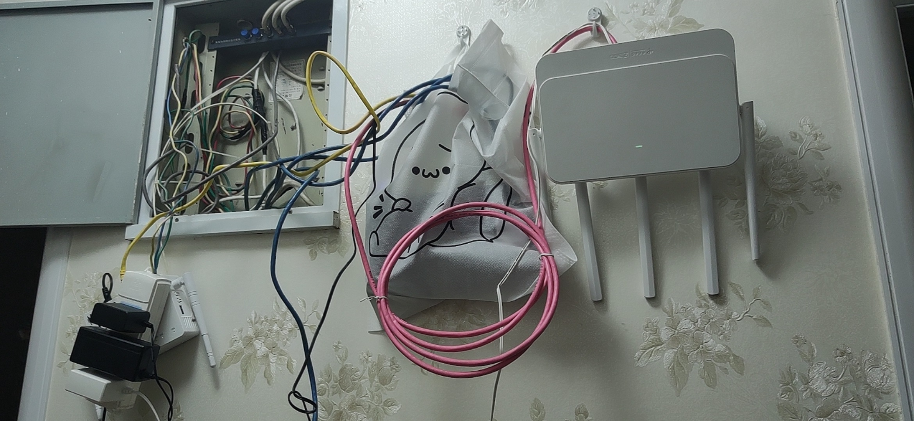

在 Путин, Владимир Владимирович 搞事之前，RB5009 的价格一直是 12xx 软妹币……

然后……然后……这玩意就成理财产品了……

观望了好几年，这玩意的价格从 12xx -> 2xxx -> 13xx 虽然价格还是很高，但是还算可以接受

不过一个 10G SFP+ 一个 2.5G RJ45，剩下 7 个都是 1000M 口这种配置，MikroTik做出来属实有些膈应人了……

哦，背板带宽还跑不满

不过主要是 E3-1265Lv3 软路由实在是撑不起家里的网络了，不得不换一个

目前杭州租的房子里机架还没搞好，只能丢个袋子里挂起来，灵车的很

等下次回台州把猫棒什么都拿来，淘汰掉联通的垃圾光猫

