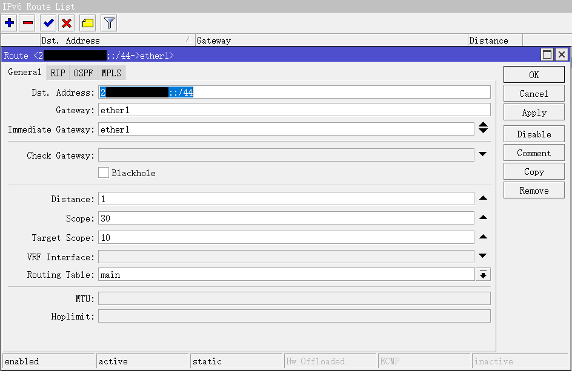

## 安装
### DD
MikroTik官方文档里推荐的安装方法是在`Setting - Custom ISO - SystemRescue`挂载镜像后操作，但是我懒，直接在 Debian 下 dd 的

```bash
wget https://download.mikrotik.com/routeros/7.9.2/chr-7.9.2.img.zip
unzip chr-7.9.2.img.zip
dd if=chr-7.9.2.img of=/dev/vda
```

这时候如果您是按照官方文档里推荐的安装方法安装的话，需要解除 ISO 挂载，机器会自动重启

### 修改用户
```bash
/user add name=rei password=密码 group=full
/user remove admin
```

### 关闭不需要的服务
我只需要 SSH 和 winbox 服务
```bash
[rei@MikroTik] > /ip service print
Flags: X, I - INVALID
Columns: NAME, PORT, CERTIFICATE, VRF
#   NAME     PORT  CERTIFICATE  VRF 
0   telnet     23               main
1   ftp        21                   
2   www        80               main
3   ssh        22               main
4 X www-ssl   443  none         main
5   api      8728               main
6   winbox   8291               main
7   api-ssl  8729  none         main
[rei@MikroTik] > /ip service set 0,1,2,4,5,7 disabled=yes
[rei@MikroTik] > /ip service print
Flags: X, I - INVALID
Columns: NAME, PORT, CERTIFICATE, VRF
#   NAME     PORT  CERTIFICATE  VRF 
0 X telnet     23               main
1 X ftp        21                   
2 X www        80               main
3   ssh        22               main
4 X www-ssl   443  none         main
5 X api      8728               main
6   winbox   8291               main
7 X api-ssl  8729  none         main
```

也许还可以改个SSH端口什么的

接下来在 winbox 下操作

### 配置 IPv6
直接 dd 安装 ROS 的 v4 是活的，但是 v6 寄了。在 `IPv6 - Address` 中添加地址


然后在 `IPv6 - Settings` 中取消勾选 `IPv6 Forward` 即可

最后 ping 一下 `2001:4860:4860::8888` （GoogleDNS）验证是否通网

## 与 Vultr 建立 BGP Sessions
### Filters
其实如果你和我一样单纯只是想在 Vultr 上收个全表的话，理论来说不用管这玩意。

以及酒后写 v7 的规则实在是容易出事，还是以后有机会再写吧

### Templates
显然，整个模板可以让我们偷懒摸鱼，我是直接修改了自带的 default 模板


### Connection
Vultr 上个人建议建立两个 Connection，也就是一个 v4 的和一个 v6 的


v4 的写法也差不多，照着改就行，其实就是把 Vultr 给你的 Bird 模板改改塞进去

然后切换到 `BGP - Sessions` 选项卡


开头的 `E` 代表 `Established` 也就是你配的没问题生效了

## 广播你自己的 IP
由于我买不起v4，所以这里只能写v6了

### Firewall
首先在 `IPv6 - Firewall - Address Lists` 中新建一条你要播的地址


### Output Network
然后在承载你这条网络所对应的 BGP Connection 中的 `Filter - Output Network` 中将其选中


### Route
在 `IPv6 - Route` 中建立一条用于承载广播地址的路由



### Address
最后就和第一步配v6网络的时候一样，在 `IPv6 - Address` 中添加地址即可


