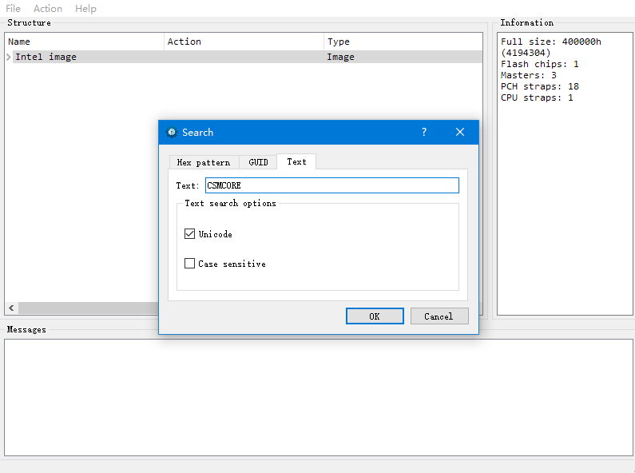

+++
title = "在凄惨红H61主板上用NVMESSD"
date = "2019-08-18T14:25:31+08:00"
tags = ["折腾"]
description = ""
+++

主要是垃圾NAS的系统U盘出问题了，然后买个个16G傲腾和PCIEx16 to M2接口的转接卡  
然而H61并没有原生的NVME支持= =只能改BIOS来解决这个问题  
我改BIOS用的是UEFITool，网上很多人用的是MMTool，然而这东西不支持Win10并且在Win7下打开凄惨红的BIOS报错  
 
在查找中选择Text然后输入CSMCORE，在Messages里面点击查找信息即可跳转  
然后向下拉，找到Volume free space  
在Volume free space上方那一大串英文字母上右键然后Insert after，插入NVMeExpressDxE.ffs  
另存为，然后刷写BIOS  
NVMeExpressDxE.ffs和UEFITool都可以谷歌找到qwq  
不要相信H61用不了NVME这种说法= =，虽然H61是老了，在我家只有这个老年NAS还在用  
末尾附上主板型号是凄惨红的C.H61HD V20