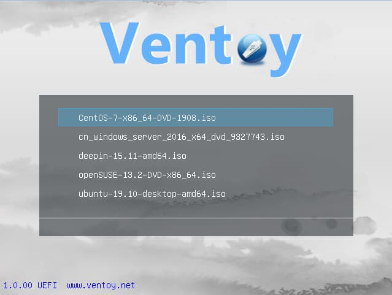

+++
title = "Ventoy:一个有趣的方式来制作USB启动U盘"
date = "2020-04-30T00:02:21+08:00"
tags = ["寄术"]
description = ""
+++

先上GitHub链接:

https://github.com/ventoy/Ventoy

我一直认为做个USB启动盘，就应该像这样，丢个原版镜像文件进去就可以选择启动，而不是用PE之类的RZ玩意，终于找到一个我认为不错的工具了，以前我一直是在用GRUB4DOS/GRUB2来启动ISO镜像文件的

贴一下GitHub的介绍吧

> # Ventoy
>
> Ventoy is an open source tool to create bootable USB drive for ISO files.
> With ventoy, you don't need to format the disk again and again, you just need to copy the iso file to the USB drive and boot it.
> You can copy many iso files at a time and ventoy will give you a boot menu to select them.
> Both Legacy BIOS and UEFI are supported in the same way. 200+ ISO files are tested.
> A "Ventoy Compatible" concept is introduced by ventoy, which can help to support any ISO file.
>
> See [https://www.ventoy.net](https://www.ventoy.net/) for detail.
>
> # Features
>
> - 100% open source
> - Simple to use
> - Fast (limited only by the speed of copying iso file)
> - Directly boot from iso file, no extraction needed
> - Legacy + UEFI supported in the same way
> - UEFI Secure Boot supported (since 1.0.07+) Notes
> - ISO files larger than 4GB supported
> - Native boot menu style for Legacy & UEFI
> - Most type of OS supported, 200+ iso files tested
> - Not only boot but also complete installation process
> - "Ventoy Compatible" concept
> - Plugin Framework
> - Readonly to USB drive during boot
> - USB normal use unafftected
> - Data nondestructive during version upgrade
> - No need to update Ventoy when a new distro is released

