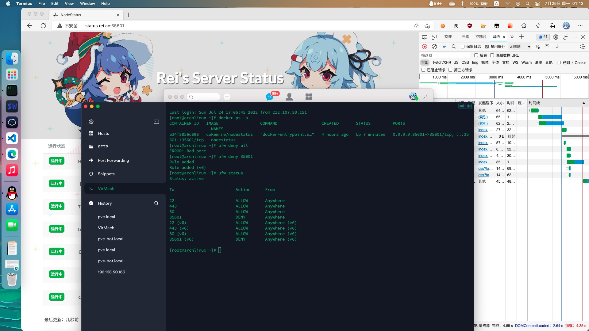
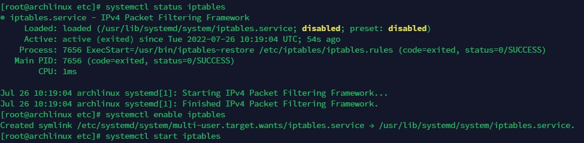
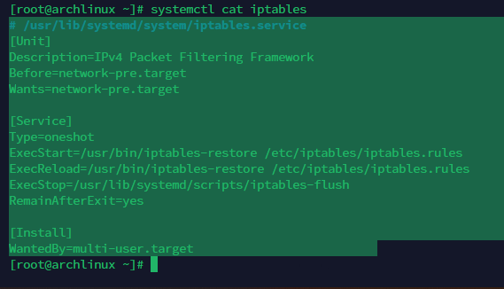

## 起因

把NodeStatus迁移到一台不用的VPS上，做好反代后`ufw deny 35601`，但是在我设置完ufw后，35601端口依旧是可以访问的

然后我迷惑的Google了一小时，发tg问了涩队木得回应，就去睡觉了

## 经过

在一顿瞎折腾发现systemd里的iptables服务没启动后就`systemctl enable iptables`和`systemctl start iptables`

发现这玩意又好用了，于是很开心的告诉涩队我好像找到问题所在了，然后涩队：“？没有enable是什么操作，这东西要enable？那个是iptables恢复的开机服务”

我：“？？？？？”

然后`systemctl cat iptables`看了一下

草！然后我试着还原现场后手动`/usr/bin/iptables-restore /etc/iptables/iptables.rules`了一下，发现也好了

怪哦

## 结果

经过涩队点拨，发现是docker的问题，ufw deny了之后，docker又重新把端口打通了草

把docker-compose.yml里面ports从"35601:35601"改成"127.0.0.1:35601:35601"就好了