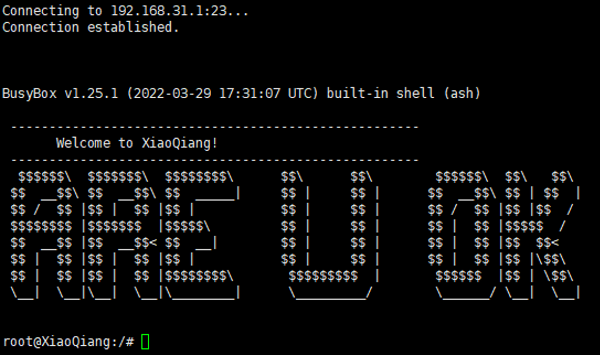
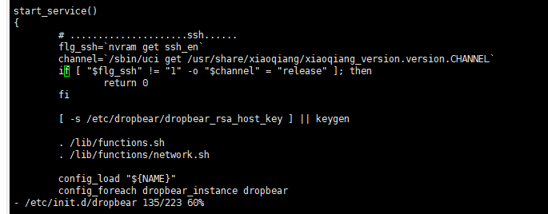
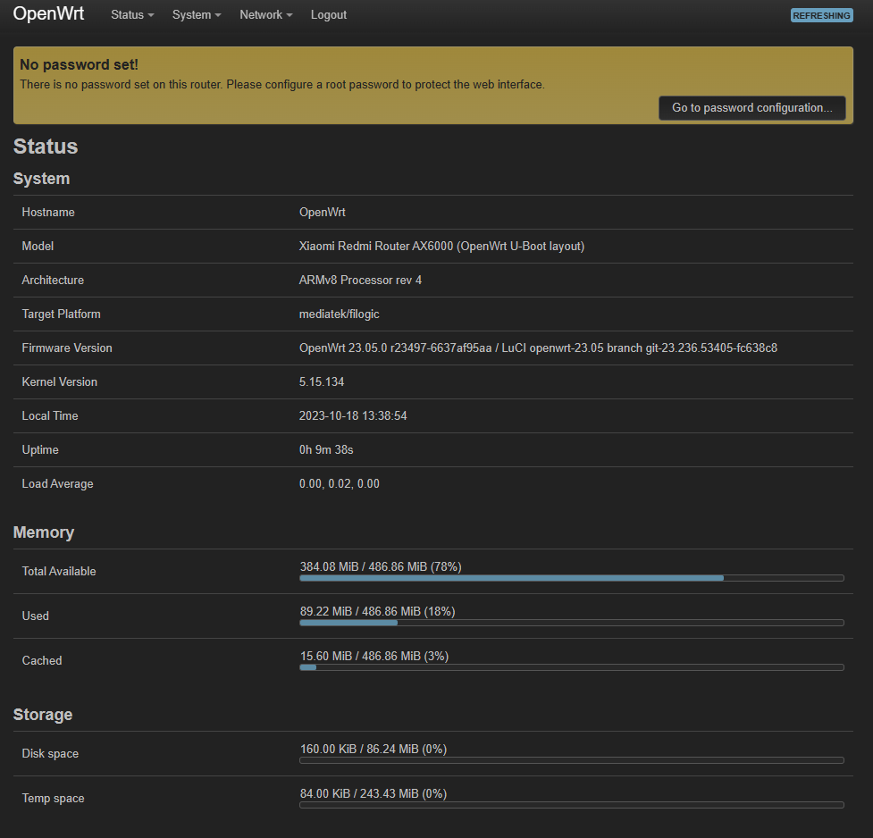

今日 OpenWRT23.05 正式版终于发了，MT7986 和 MT7981 系列芯片终于有 OP 的正式版支持了，于是就海鲜市场三百大洋收了一台 Redmi AX6000 应该是最便宜的 MT7986 路由器了（以及还是 openwrt.org 上[文档](https://openwrt.org/toh/xiaomi/redmi_ax6000)最详细的一款 MT7986 路由器）

## 打开原厂固件的SSH

### 降级（如果您准备直接TTL刷可以不看这里）

首先先要将路由器降级到 [1.0.48 版本固件](https://cdn.cnbj1.fds.api.mi-img.com/xiaoqiang/rom/rb06/miwifi_rb06_firmware_847e9_1.0.48.bin) 在小米的升级界面可以直接选择旧版固件降级，然后系统会告诉你禁止降级，此时看到浏览器上方链接有个 `downgrade=` 如果后面的数字是 `0` 则改成 `1`，是 `1`（见于 `1.0.64` 版本固件）则改成 `2` 

### 打开调试模式

进入 WebUI，登陆后看到的 URL 类似于

```
http://你的路由器IP/cgi-bin/luci/;stok={token}/后面一堆东西
```

然后将链接改成

```
http://你的路由器IP/cgi-bin/luci/;stok={token}/api/misystem/set_sys_time?timezone=%20%27%20%3B%20echo%20pVoAAA%3D%3D%20%7C%20base64%20-d%20%7C%20mtd%20write%20-%20crash%20%3B%20
```

这样将会在路由器中执行 `echo pVoAAA== | base64 -d | mtd write - crash`，然后使用 

```
http://192.168.31.1/cgi-bin/luci/;stok={token}/api/misystem/set_sys_time?timezone=%20%27%20%3b%20reboot%20%3b%20
```

来重启路由器

### 修改 Bdata

重新登陆路由器 WebUI 此时 token 有变化，记得不要使用之前的链接操作

```
http://你的路由器IP/cgi-bin/luci/;stok={token}/api/misystem/set_sys_time?timezone=%20%27%20%3B%20bdata%20set%20telnet_en%3D1%20%3B%20bdata%20set%20ssh_en%3D1%20%3B%20bdata%20commit%20%3B%20
```

这条在路由器中执行 `bdata set telnet_en=1 ; bdata set ssh_en=1 ; bdata commit`

然后使用 
```
http://192.168.31.1/cgi-bin/luci/;stok={token}/api/misystem/set_sys_time?timezone=%20%27%20%3b%20reboot%20%3b%20
```
来重启路由器

接着就可以 telnet 连接路由器了

### 打开 SSH

首先 telnet 连接到路由器，看到经典的 ARE U OK 彩蛋



然后用 vi 删除 `/etc/init.d/dropbear` 中 135 行到 137 行，其中内容是

```bash
if [ "$flg_ssh" != "1" -o "$channel" = "release" ]; then        
  return 0                                                           
fi
```


然后使用 `/etc/init.d/dropbear start` 来启动 dropbear 服务

接着用 passwd 来设置 root 账户的密码后就可以用SSH连接到路由器啦~

## 安装原厂分区的 OpenWRT

### 设置启动分区

首先我们使用 `cat /proc/mtd` 来查看原厂分区长什么样子
```bash
root@XiaoQiang:~# cat /proc/mtd
dev:    size   erasesize  name
mtd0: 08000000 00020000 "spi0.1"
mtd1: 00100000 00020000 "BL2"
mtd2: 00040000 00020000 "Nvram"
mtd3: 00040000 00020000 "Bdata"
mtd4: 00200000 00020000 "Factory"
mtd5: 00200000 00020000 "FIP"
mtd6: 00040000 00020000 "crash"
mtd7: 00040000 00020000 "crash_log"
mtd8: 01e00000 00020000 "ubi"
mtd9: 01e00000 00020000 "ubi1"
mtd10: 03200000 00020000 "overlay"
```

有两个启动分区，类似于 `Android` 的 `AB` 分区

然后使用 `cat /proc/cmdline` 来查看当前的启动分区，得到类似以下结果

```bash
root@XiaoQiang:~# cat /proc/cmdline
console=ttyS0,115200n1 loglevel=8 firmware=1 factory_mode=1 uart_en=1
```
如果 `firmware=1` 当前启动分区为 `ubi1`，如果 `firmware=0` ，当前启动分区为 `ubi`

以我手上这台 `firmware=1` 为例，设置下一次的启动分区为 `ubi` 也就是 `mtd8`

```bash
root@XiaoQiang:~# nvram set boot_wait=on
root@XiaoQiang:~# nvram set uart_en=1
root@XiaoQiang:~# nvram set flag_boot_rootfs=0
root@XiaoQiang:~# nvram set flag_last_success=0
root@XiaoQiang:~# nvram set flag_boot_success=1
root@XiaoQiang:~# nvram set flag_try_sys1_failed=0
root@XiaoQiang:~# nvram set flag_try_sys2_failed=0
root@XiaoQiang:~# nvram commit
```

### 刷入 initramfs

然后为路由器刷入 initramfs 后重启， 我这里为了确保不受到国际互联网连接的影响，直接在本机起了一个 Nginx，互联网连接好的话也可以直接 wget op 的官方源

```bash
root@XiaoQiang:/tmp# wget http://本机IP/AX6000/openwrt-23.05.0-mediatek-filogic-xiaomi_redmi-router-ax6000-stock-initramfs-factory.ubi
Connecting to 本机IP (本机IP:80)
openwrt-23.05.0-medi 100% |*********************************************************************************************|  8320k  0:00:00 ETA
root@XiaoQiang:/tmp# ubiformat /dev/mtd8 -y -f /tmp/openwrt-23.05.0-mediatek-filogic-xiaomi_redmi-router-ax6000-stock-initramfs-factory.ubi 
ubiformat: mtd8 (nand), size 31457280 bytes (30.0 MiB), 240 eraseblocks of 131072 bytes (128.0 KiB), min. I/O size 2048 bytes
libscan: scanning eraseblock 239 -- 100 % complete  
ubiformat: 240 eraseblocks have valid erase counter, mean value is 0
ubiformat: flashing eraseblock 64 -- 100 % complete  
ubiformat: formatting eraseblock 239 -- 100 % complete  
root@XiaoQiang:/tmp# reboot
root@XiaoQiang:/tmp# Connection closing...Socket close.

Connection closed by foreign host.
```

其实这一步之后就可以直接跳到 uboot 然后刷入 ubootmod 固件，但是这样风险比较高，如果想这样做的话，这里直接刷入 `ubootmod-initramfs-factory.ubi` 固件然后直接跳到下一步

### 设置 uboot-env

这里用于设置总是于 system 0 启动
```bash
fw_setenv boot_wait on
fw_setenv uart_en 1
fw_setenv flag_boot_rootfs 0
fw_setenv flag_last_success 1
fw_setenv flag_boot_success 1
fw_setenv flag_try_sys1_failed 8
fw_setenv flag_try_sys2_failed 8
fw_setenv mtdparts "nmbm0:1024k(bl2),256k(Nvram),256k(Bdata),2048k(factory),2048k(fip),256k(crash),256k(crash_log),30720k(ubi),30720k(ubi1),51200k(overlay)"
```

然后随意使用 WebUI 或者是 `sysupgrade` 指令安装 OpenWRT

这一步做完当 AP 什么的就已经可以用了，如果你要在上面安装 114514 个软件或者只是觉得官方分区傻逼，想来点开源的 Openwrt U-boot 的话可以接着往下看

## 安装 ubootmod 分区的 OpenWRT

### 备份
可以用 WebUI 的备份或者 cat 后 ZMODEM 传输
```bash
root@OpenWrt:~# opkg update
# 这里太长略过
root@OpenWrt:~# opkg install lrzsz
Installing lrzsz (0.12.21-1) to root...
Downloading https://downloads.openwrt.org/releases/23.05.0/packages/aarch64_cortex-a53/packages/lrzsz_0.12.21-1_aarch64_cortex-a53.ipk
Configuring lrzsz.
root@OpenWrt:~# cat /dev/mtdblock0 > /tmp/BL2.bin
root@OpenWrt:~# sz /tmp/BL2.bin 

root@OpenWrt:~# cat /dev/mtdblock1 > /tmp/Nvram.bin
root@OpenWrt:~# sz /tmp/Nvram.bin 
rz
root@OpenWrt:~# cat /dev/mtdblock2 > /tmp/Bdata.bin
root@OpenWrt:~# sz /tmp/Bdata.bin 

root@OpenWrt:~# cat /dev/mtdblock3 > /tmp/Factory.bin
root@OpenWrt:~# sz /tmp/Factory.bin 
rz
root@OpenWrt:~# cat /dev/mtdblock4 > /tmp/FIP.bin
root@OpenWrt:~# sz /tmp/FIP.bin 
rz
```

### 查看当前分区（非必须，但是保险起见看一眼）

```bash
root@OpenWrt:~# cat /proc/mtd
dev:    size   erasesize  name
mtd0: 00100000 00020000 "BL2"
mtd1: 00040000 00020000 "Nvram"
mtd2: 00040000 00020000 "Bdata"
mtd3: 00200000 00020000 "Factory"
mtd4: 00200000 00020000 "FIP"
mtd5: 00040000 00020000 "crash"
mtd6: 00040000 00020000 "crash_log"
mtd7: 01e00000 00020000 "ubi_kernel"
mtd8: 05000000 00020000 "ubi"
```

### 刷入 ubootmod initramfs

依旧是本地起的 Nginx
```bash
root@OpenWrt:~# wget http://本机IP/AX6000/openwrt-23.05.0-mediatek-filogic-xiaomi_redmi-router-ax6000-ubootmod-initramfs-factory.ubi
Downloading 'http://本机IP/AX6000/openwrt-23.05.0-mediatek-filogic-xiaomi_redmi-router-ax6000-ubootmod-initramfs-factory.ubi'
Connecting to 本机IP:80
Writing to 'openwrt-23.05.0-mediatek-filogic-xiaomi_redmi-router-ax6000-ubootmod-initramfs-factory.ubi'
openwrt-23.05.0-medi 100% |*******************************|  8320k  0:00:00 ETA
Download completed (8519680 bytes)
root@OpenWrt:~# ubiformat /dev/mtd7 -y -f ./openwrt-23.05.0-mediatek-filogic-xiaomi_redmi-router-ax6000-ubootmod-initramfs-factory.ubi 
ubiformat: mtd7 (nand), size 31457280 bytes (30.0 MiB), 240 eraseblocks of 131072 bytes (128.0 KiB), min. I/O size 2048 bytes
libscan: scanning eraseblock 239 -- 100 % complete  
ubiformat: 240 eraseblocks have valid erase counter, mean value is 2
ubiformat: flashing eraseblock 64 -- 100 % complete  
ubiformat: formatting eraseblock 239 -- 100 % complete  
```
重启

### 再次查看当前分区（非必须，但是保险起见再看一眼）
```bash
root@OpenWrt:~# cat /proc/mtd
dev:    size   erasesize  name
mtd0: 00100000 00020000 "BL2"
mtd1: 00040000 00020000 "Nvram"
mtd2: 00040000 00020000 "Bdata"
mtd3: 00200000 00020000 "Factory"
mtd4: 00200000 00020000 "FIP"
mtd5: 07a80000 00020000 "ubi"
```

### 修改分区

安装并加载 kmod-mtd-rw 内核模块

```bash
root@OpenWrt:~# opkg update && opkg install kmod-mtd-rw
# 太长略过 
Installing kmod-mtd-rw (5.15.134+git-20160214-2) to root...
Downloading https://downloads.openwrt.org/releases/23.05.0/targets/mediatek/filogic/packages/kmod-mtd-rw_5.15.134%2bgit-20160214-2_aarch64_cortex-a53.ipk
Configuring kmod-mtd-rw.
root@OpenWrt:~# insmod /lib/modules/$(uname -r)/mtd-rw.ko i_want_a_brick=1
```

删除所有的崩溃转储文件以防止 OpenWRT Uboot 启动到恢复模式

```bash
rm -f /sys/fs/pstore/*
```

格式化 ubi 并且创建新的 uboot-env 分区

```bash
root@OpenWrt:~# ubidetach -p /dev/mtd5; ubiformat /dev/mtd5 -y; ubiattach -p /dev/mtd5
ubidetach: error!: cannot detach "/dev/mtd5"
           error 19 (No such device)
ubiformat: mtd5 (nand), size 128450560 bytes (122.5 MiB), 980 eraseblocks of 131072 bytes (128.0 KiB), min. I/O size 2048 bytes
libscan: scanning eraseblock 979 -- 100 % complete  
ubiformat: 880 eraseblocks have valid erase counter, mean value is 1
ubiformat: 96 eraseblocks are supposedly empty
ubiformat: warning!: 4 of 980 eraseblocks contain non-UBI data
ubiformat: warning!: only 880 of 980 eraseblocks have valid erase counter
ubiformat: mean erase counter 1 will be used for the rest of eraseblock
ubiformat: use erase counter 1 for all eraseblocks
ubiformat: formatting eraseblock 979 -- 100 % complete  
UBI device number 0, total 980 LEBs (124436480 bytes, 118.6 MiB), available 954 LEBs (121135104 bytes, 115.5 MiB), LEB size 126976 bytes (124.0 KiB)
root@OpenWrt:~# ubimkvol /dev/ubi0 -n 0 -N ubootenv -s 128KiB
Volume ID 0, size 2 LEBs (253952 bytes, 248.0 KiB), LEB size 126976 bytes (124.0 KiB), dynamic, name "ubootenv", alignment 1
root@OpenWrt:~# ubimkvol /dev/ubi0 -n 1 -N ubootenv2 -s 128KiB
Volume ID 1, size 2 LEBs (253952 bytes, 248.0 KiB), LEB size 126976 bytes (124.0 KiB), dynamic, name "ubootenv2", alignment 1
```

创建 OpenWrt U-Boot 的 NAND 恢复模式分区并刷入 `ubootmod-initramfs-recovery.itb`

这一步可选，不做也有 tftp 恢复模式可以用，可用空间也大一点

```bash
root@OpenWrt:~# ubimkvol /dev/ubi0 -n 2 -N recovery -s 10MiB
Volume ID 2, size 83 LEBs (10539008 bytes, 10.0 MiB), LEB size 126976 bytes (124.0 KiB), dynamic, name "recovery", alignment 1
root@OpenWrt:~# wget http://本机IP/AX6000/openwrt-23.05.0-mediatek-filogic-xiaomi_redmi-router-ax6000-ubootmod-initramfs-recovery.itb
Downloading 'http://本机IP/AX6000/openwrt-23.05.0-mediatek-filogic-xiaomi_redmi-router-ax6000-ubootmod-initramfs-recovery.itb'
Connecting to 本机IP:80
Writing to 'openwrt-23.05.0-mediatek-filogic-xiaomi_redmi-router-ax6000-ubootmod-initramfs-recovery.itb'
openwrt-23.05.0-medi 100% |*******************************|  7104k  0:00:00 ETA
Download completed (7274496 bytes)
root@OpenWrt:~# ubiupdatevol /dev/ubi0_2 ./openwrt-23.05.0-mediatek-filogic-xiaomi_redmi-router-ax6000-ubootmod-initramfs-recovery.itb 
```

### 刷入 OpenWRT U-boot

```bash
root@OpenWrt:~# wget http://本机IP/AX6000/openwrt-23.05.0-mediatek-filogic-xiaomi_redmi-router-ax6000-ubootmod-preloader.bin
Downloading 'http://本机IP/AX6000/openwrt-23.05.0-mediatek-filogic-xiaomi_redmi-router-ax6000-ubootmod-preloader.bin'
Connecting to 本机IP:80
Writing to 'openwrt-23.05.0-mediatek-filogic-xiaomi_redmi-router-ax6000-ubootmod-preloader.bin'
openwrt-23.05.0-medi 100% |*******************************|   200k  0:00:00 ETA
Download completed (205560 bytes)
root@OpenWrt:~# mtd write ./openwrt-23.05.0-mediatek-filogic-xiaomi_redmi-router-ax6000-ubootmod-preloader.bin BL2
Unlocking BL2 ...

Writing from ./openwrt-23.05.0-mediatek-filogic-xiaomi_redmi-router-ax6000-ubootmod-preloader.bin to BL2 ...     
root@OpenWrt:~# wget http://本机IP/AX6000/openwrt-23.05.0-mediatek-filogic-xiaomi_redmi-router-ax6000-ubootmod-bl31-uboot.fip
Downloading 'http://本机IP/AX6000/openwrt-23.05.0-mediatek-filogic-xiaomi_redmi-router-ax6000-ubootmod-bl31-uboot.fip'
Connecting to 本机IP:80
Writing to 'openwrt-23.05.0-mediatek-filogic-xiaomi_redmi-router-ax6000-ubootmod-bl31-uboot.fip'
openwrt-23.05.0-medi 100% |*******************************|   718k  0:00:00 ETA
Download completed (735409 bytes)
root@OpenWrt:~# mtd write ./openwrt-23.05.0-mediatek-filogic-xiaomi_redmi-router-ax6000-ubootmod-bl31-uboot.fip FIP
Unlocking FIP ...

Writing from ./openwrt-23.05.0-mediatek-filogic-xiaomi_redmi-router-ax6000-ubootmod-bl31-uboot.fip to FIP ...     
```

最后，用 WebUI 或者 sysupgrade 指令刷入 ubootmod-squashfs-sysupgrade 固件即可

