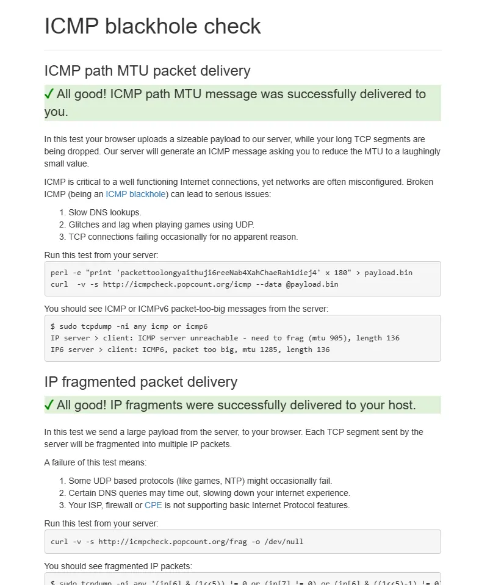
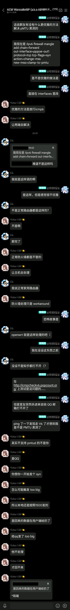

当我刚刚用 RB5009 替换掉之前的老 E3 后并配好了 IPv6

结果大概一小时后，室友突然闯进了我的房间，用我的电脑测试打开了 mail.qq.com

恐怖故事就此发生，我的电脑对此响应缓慢，而室友的电脑直接就无法打开

试了一下让猫猫头软件启用全局模式之后，世界又好了起来

我的第一反应是：鹅炸了？

那显然不是……

第二反应是 DNS 的问题，解析到了神必目标，遂把室友电脑的 DNS 改到 114

结果没用，不是这个原因（要不然也不会有这篇了……）

接着试了一下 `ping mail.qq.com` 发现解析到了IPv6地址，遂反应过来，是不是 PMTU 黑洞了

赶紧打开 http://icmpcheckv6.popcount.org/ 来测一下，结果全绿



不过还是死马当成活马医了一下（主要是有点懒的监看一下流量，抓包看一眼）

```bash
/ipv6 firewall mangle add chain=forward out-interface=pppoe-out1 protocol=tcp tcp-flags=syn action=change-mss new-mss=clamp-to-pmtu
```

结果……结果真的活了！

问了下群友

