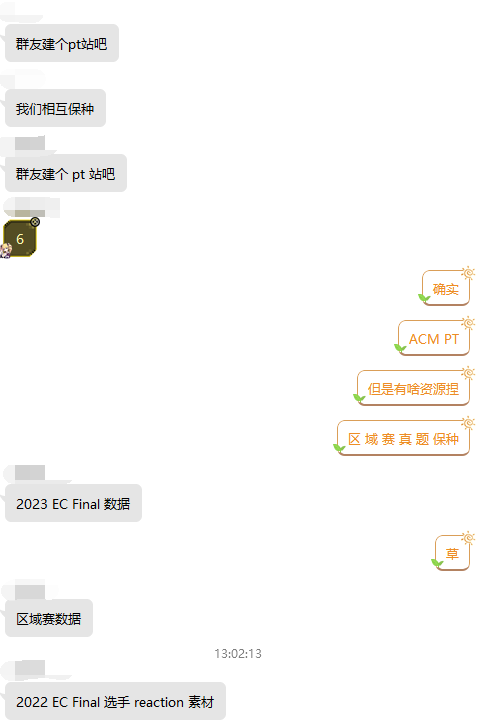

# 警告：发现了这东西在安全性上的一些隐患

## 起因

之所以会想到搭建个 PT 站是因为在 ACMer 垃圾佬交流群里群友们的突发奇想



最开始想用的是 gazelle 或 ZJUNexusPHP，但是显然这些程序都太古老了，经过一番 Github 冲浪，就找到了这个 NodeJS 写的 [Sqtracker](https://github.com/tdjsnelling/sqtracker) 在众多开源 PT 程序中还算比较符合我的审美

## 搭建

### 修改配置

如果按照官方的搭建方法其实只要`git clone` 然后 `docker-compose up -d` 就可以完成，但是由于其使用了我不是很喜欢的 traefik 并且 mongo 在本地，所以我们需要修改其`docker-compose.yml`

```yaml
version: "3.9"
services:
  # traefik:
  #   image: "traefik:v2.5"
  #   container_name: "sq_traefik"
  #   command:
  #     - "--api.insecure=true"
  #     - "--providers.file=true"
  #     - "--providers.file.filename=/config/traefik.yml"
  #     - "--entrypoints.webinsecure.address=:80"
  #     - "--entrypoints.web.address=:443"
  #     - "--entryPoints.web.proxyProtocol.insecure"
  #     - "--entryPoints.web.forwardedHeaders.insecure"
  #     - "--certificatesresolvers.tlsresolver.acme.email=pt@acmer.info"
  #     - "--certificatesresolvers.tlsresolver.acme.storage=/letsencrypt/acme.json"
  #     - "--certificatesresolvers.tlsresolver.acme.httpchallenge=true"
  #     - "--certificatesresolvers.tlsresolver.acme.httpchallenge.entrypoint=webinsecure"
  #   ports:
  #     - "80:80"
  #     - "443:443"
  #     - "8080:8080"
  #   volumes:
  #     - "/var/run/docker.sock:/var/run/docker.sock:ro"
  #     - ./letsencrypt:/letsencrypt
  #     - ./traefik.yml:/config/traefik.yml
  # database:
  #   container_name: sq_mongodb
  #   image: mongo:6.0
  #   ports:
  #     - "127.0.0.1:27017:27017"
  #   volumes:
  #     - ./data:/data/db
  api:
    container_name: sq_api
    image: ghcr.io/tdjsnelling/sqtracker-api:latest
    ports:
      - "127.0.0.1:3001:3001"
    volumes:
      - ./config.js:/sqtracker/config.js
    # depends_on:
    #   - database
  client:
    container_name: sq_client
    image: ghcr.io/tdjsnelling/sqtracker-client:latest
    ports:
      - "127.0.0.1:3000:3000"
    volumes:
      - ./config.js:/sqtracker/config.js
      # - ./favicon.png:/sqtracker/public/favicon.png
      # - ./favicon.ico:/sqtracker/public/favicon.ico
    depends_on:
      - api
```

然后编辑 `config.js` 修改配置（这文件注释很详细了，看着改就行）

```js
module.exports = {
  envs: {
    SQ_SITE_NAME: "ACMer PT",
    SQ_SITE_DESCRIPTION: "A Private Tracker site for Competitive programming player",
    SQ_CUSTOM_THEME: {
      primary: "#f45d48",
    },
    SQ_ALLOW_REGISTER: "open",
    SQ_ALLOW_ANONYMOUS_UPLOADS: false,
    SQ_MINIMUM_RATIO: 0.75,
    SQ_MAXIMUM_HIT_N_RUNS: 1,
    SQ_TORRENT_CATEGORIES: {
      Videos: [],
      Problems: [],
      Books: [],
      Misc: [],
    },
    SQ_BP_EARNED_PER_GB: 1,
    SQ_BP_EARNED_PER_FILLED_REQUEST: 1,
    SQ_BP_COST_PER_INVITE: 3,
    SQ_BP_COST_PER_GB: 3,
    SQ_SITE_WIDE_FREELEECH: false,
    SQ_ALLOW_UNREGISTERED_VIEW: false,
    SQ_EXTENSION_BLACKLIST: ["exe"],
    SQ_BASE_URL: "https://pt.acmer.info",
    SQ_API_URL: "https://pt.acmer.info/api",
    SQ_MONGO_URL: "不告诉你喵",
    SQ_MAIL_FROM_ADDRESS: "pt@acmer.info",
    SQ_SMTP_HOST: "SMTP邮件服务器",
    SQ_SMTP_PORT: 587,
    SQ_SMTP_SECURE: false,
  },
  secrets: {
    SQ_JWT_SECRET: "不告诉你喵",
    SQ_SERVER_SECRET: "不告诉你喵",
    SQ_ADMIN_EMAIL: "你的邮件喵",
    SQ_SMTP_USER: "pt@acmer.info",
    SQ_SMTP_PASS: "SMTP邮件密码喵",
  },
};

```

接着`docker-compose up -d`即可

### Nginx 配置

阅读仓库中的 `traefik.yml` 发现要反代 `/` `/api` 以及 `/sq`

```nginx
server {
    listen 80; # 这里开80仅用于测试，测试完成后要套上SSL
    server_name pt.acmer.info;

    location / {
	proxy_pass http://localhost:3000/;
        proxy_http_version                1.1;

        # Proxy Headers
        proxy_set_header Upgrade          $http_upgrade;
        proxy_set_header Host             $host;
        # proxy_set_header Connection       $connection_upgrade;
        proxy_set_header X-Real_IP        $remote_addr;
        proxy_set_header X-Real-Host      $host;
        proxy_set_header X-Forwarded-For  $remote_addr;
    }

    location ^~ /api/ {
        proxy_pass http://localhost:3001/;
	proxy_http_version                1.1;

        # Proxy Headers
        proxy_set_header Upgrade          $http_upgrade;
        proxy_set_header Host             $host;
        # proxy_set_header Connection       $connection_upgrade;
        proxy_set_header X-Real_IP        $remote_addr;
        proxy_set_header X-Real-Host      $host;
        proxy_set_header X-Forwarded-For  $remote_addr;
    }

    location ^~ /sq/ {
        proxy_pass http://localhost:3001;
        proxy_http_version                1.1;

        # Proxy Headers
        proxy_set_header Upgrade          $http_upgrade;
        proxy_set_header Host             $host;
        # proxy_set_header Connection       $connection_upgrade;
        proxy_set_header X-Real_IP        $remote_addr;
        proxy_set_header X-Real-Host      $host;
        proxy_set_header X-Forwarded-For  $remote_addr;
    }

}

```

注意这里的 `/sq/` 反代位置是不需要反斜杠的